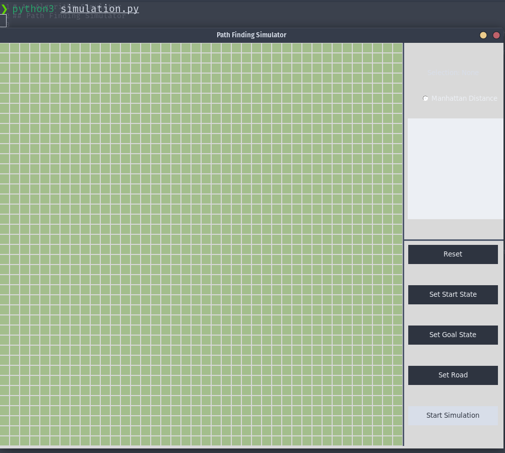
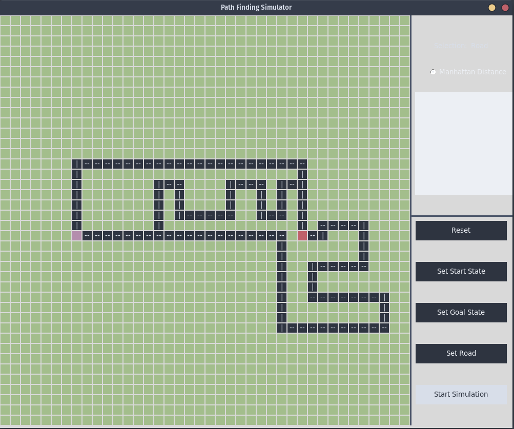
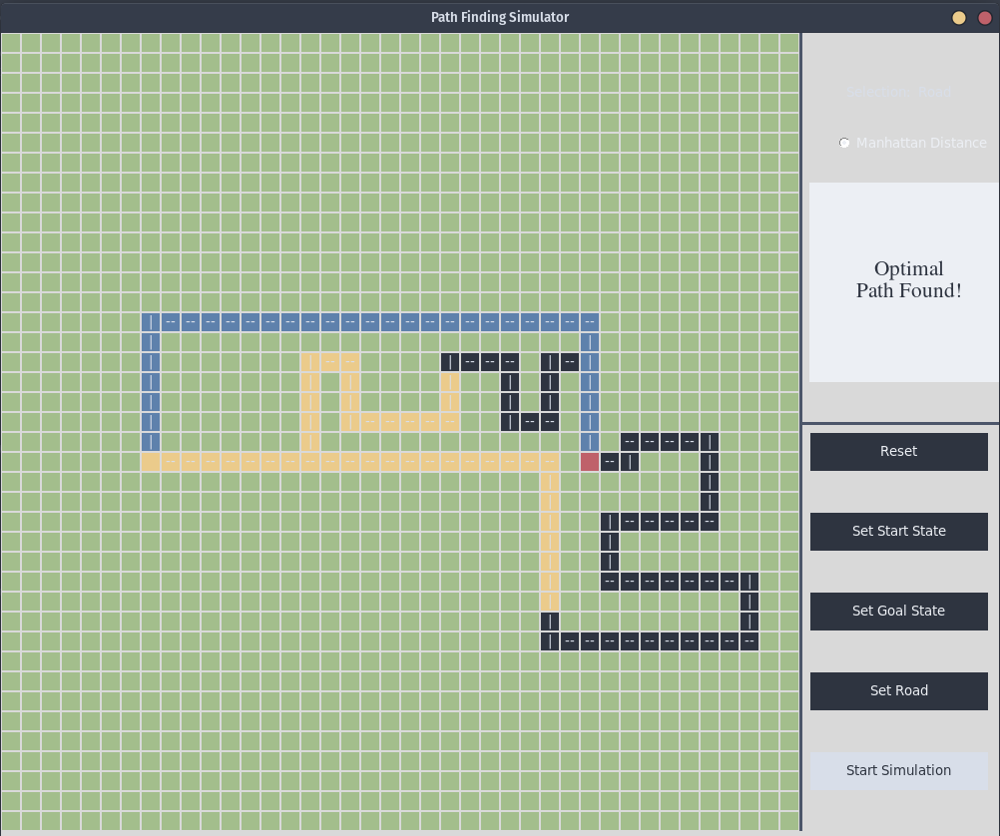

# A* Algorithm Simulator
## Path Finding Simulator

[](https://github.com/AsjadIftikhar/PandaCompiler.git)

This simulator is a Python (Tkinter) based desktop application which finds the shortes path between two given points using the popular optimal path finding search algorithm: [A* algorithm](https://en.wikipedia.org/wiki/A*_search_algorithm). 
It was created in Artifical Intelligence Course during Spring 2021.

## Features

- Python
- Tkinter
- A* Algorithm
- Path Finding on a road network


## Sample Run of the Simulator:



## Setting up a scenario



## Executing Simulation



## Installation


Install Tkinter Library

```sh
sudo apt-get install python3-tk
```

Change directory to the one containing simulation.py file.

```sh
cd path/to/simulation/file
```

Run Simulation

```sh
Python3 simulation.py
```


Good Luck! Have a nice day.

